# Angular JSON Form

[](https://www.npmjs.com/package/angular-json-form)
[](https://www.npmjs.com/package/angular-json-form)

## Installation

```sh
npm install angular-json-form
```
-----
## Quickstart

#### 1. Add the `AngularJsonFormModule` to `imports` in `src/app/app.module.ts`:

```ts
import { NgModule } from '@angular/core';
import { BrowserModule } from '@angular/platform-browser';

import { AngularJsonFormModule } from 'angular-json-form';

import { AppComponent } from './app.component';

@NgModule({
  declarations: [
    AppComponent
  ],
  imports: [
    BrowserModule,
    JsonFormAngularModule
  ],
  providers: [],
  bootstrap: [AppComponent]
})
export class AppModule { }

```

#### 2. Add the form object in your component ts file:

```ts
import { Component } from '@angular/core';

@Component({
    selector: 'app-root',
    templateUrl: './app.component.html',
    styleUrls: ['./app.component.css']
})
export class AppComponent {
    title = 'json-form-app';
    form: any = {
        // options
    };
}
```

#### 3. Add the component in the html template:

```html
<angular-json-form [form]="form"></angular-json-form>
```

#### 4. Quickstart.
Set the form object for a classic login form with 2 controls, one text type and anohter password type, plus the submit button.

```javascript
{
    title: "Example form.",
    groups: [
        {
            fields: [
                {
                    name: "user",
                    type: "text",
                    label: "User",
                    required: true,
                },
            ],
        },
        {
            fields: [
                {
                    name: "password",
                    type: "password",
                    label: "Password",
                    required: true,
                },
            ],
        },
    ],
    buttons: [
        {
            text: "Login",
            submit: true,
            primary: true,
        },
    ],
}
```
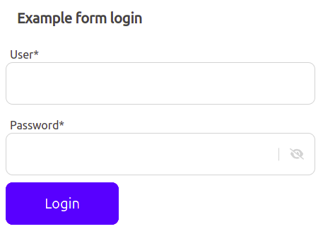

#### 5. Submit and handle values.
In the html template, add the event `(send)` to capture the Submit, and send the parameters `($event)` to a custom function.
```html
<angular-json-form [form]="form" (send)="handleValues($event)"></angular-json-form>
```
Create a custom function in your component ts file.
```ts
handleValues(values) {
    // Do something...
}
```
-----
## Usage

### Input Types
Each element in a `groups` array, is a line of the form and each element in a `fields` array is a input in a group line. Properties `name` and `type` are required.
#### Text, Number, E-Mail and Tel.
```javascript
{
    fields: [
        {
            name: "textname",
            type: "text",
            label: "Text Label",
        },
    ],
},
{
    fields: [
        {
            name: "numbername",
            type: "number",
            label: "Number Label",
        },
    ],
},
{
    fields: [
        {
            name: "emailname",
            type: "email",
            label: "E-Mail Label",
        },
    ],
},
{
    fields: [
        {
            name: "telname",
            type: "tel",
            label: "Tel Label",
        },
    ],
},
```
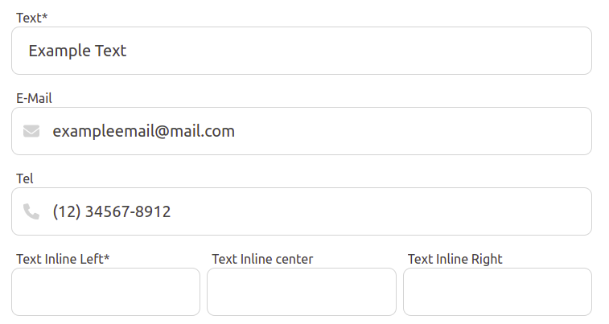

#### Checkbox and Radio button.
```javascript
{
    fields: [
        {
            name: "checkboxname",
            type: "checkbox",
            label: "CheckBox Label",
            text: "CheckBox Text",
        },
    ],
},
{
    fields: [
        {
            name: "radioname",
            type: "radio",
            label: "Radio Label",
            options: ["Option 1", "Option 2", "Option 3"],
        },
    ],
},
```
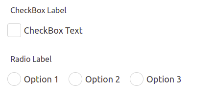

#### Password.
```javascript
{
    fields: [
        {
            name: "passwordname",
            type: "password",
            label: "Password Label",
        },
    ],
},
```
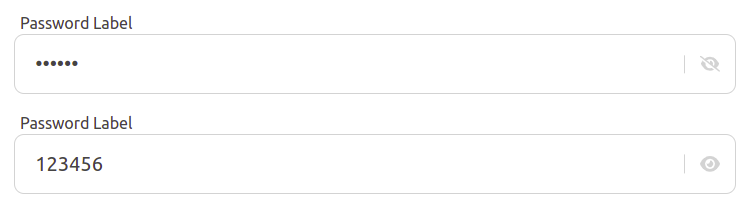

#### Select, single and multiple options.
```javascript
{
    fields: [
        {
            name: "selectname",
            type: "select",
            label: "Select Label",
            options: ["Option 1", "Option 2", "Option 3"],
        },
    ],
},
{
    fields: [
        {
            name: "selectmultiplename",
            type: "select",
            label: "Multiple Select Label",
            options: ["Option 1", "Option 2", "Option 3"],
            multiple: true,
        },
    ],
},
```
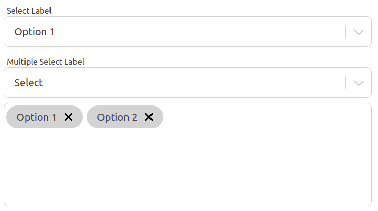

#### List items.
```javascript
{
    fields: [
        {
            name: "listname",
            type: "list",
            label: "List Label",
        },
    ],
},
```
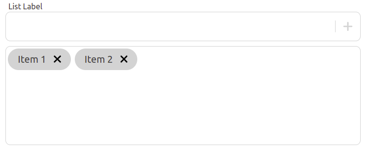

#### Color selector.
```javascript
{
    fields: [
        {
            name: "colorname",
            type: "color",
            label: "Color Label",
        },
    ],
},
```
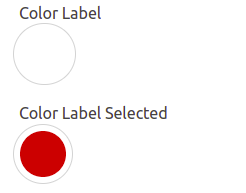

#### Image upload, contain and cover format preview.
Property `max` is required.
```javascript
{
    fields: [
        {
            name: "imagecontain",
            type: "image",
            label: "Image Contain Label",
            max: 500000,
        },
    ],
},
{
    fields: [
        {
            name: "imagecover",
            type: "image",
            label: "Image Cover Label",
            max: 500000,
            cover: true,
        },
    ],
},
```
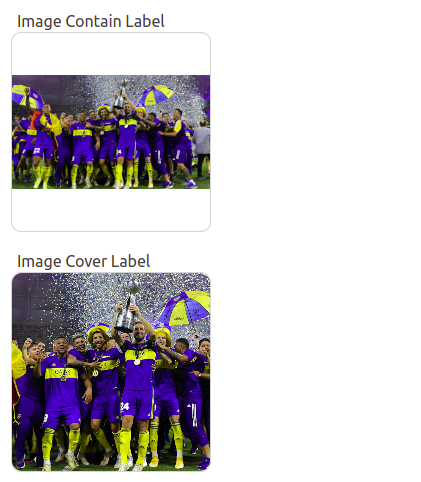

#### Multiple Image upload.
```javascript
{
    fields: [
        {
            name: "imagemultiplename",
            type: "image",
            label: "Multiple Images upload",
            max: 500000,
            multiple: true,
        },
    ],
},
```
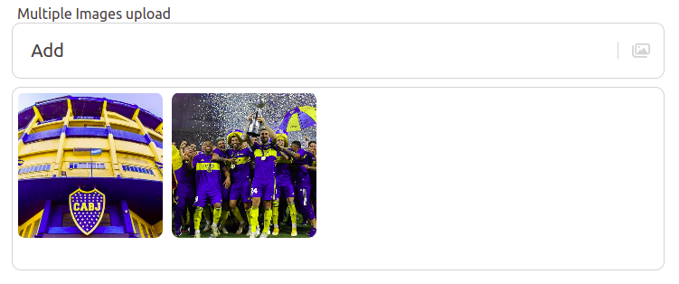

#### Textarea.
```javascript
{
    fields: [
        {
            name: "textareaname",
            type: "textarea",
            label: "Textarea Label",
        },
    ],
},
```
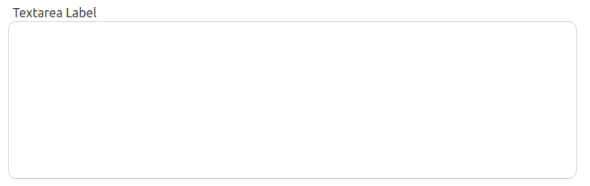

#### Hidden.
```javascript
{
    fields: [
        {
            name: "hiddenname",
            type: "hidden",
        },
    ],
},
```
### Inline fields
```javascript
{
    fields: [
        {
            name: "text2name",
            type: "text",
            label: "Text Inline Left",
            required: true,
        },
        {
            name: "text3name",
            type: "text",
            label: "Text Inline center",
        },
        {
            name: "text4name",
            type: "text",
            label: "Text Inline Right",
        },
    ],
},
```
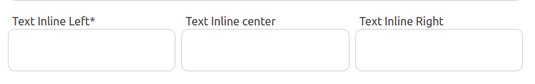

### Button Set
Each element in a `buttons` array, is a button in a group line.
```javascript
{
    text: "No",
    event: "no",
},
{
    text: "Yes",
    submit: true,
    primary: true,
},
```


Only one element must be a `submit` button. Set the `(event)` in a html template to capture the other events button.
```html
<angular-json-form [form]="form" (event)="handleEvent($event)" (send)="handleValues($event)"></angular-json-form>
```
Create a custom function in your component ts file.
```ts
handleEvent(event) {
    // Do something...
}
```
-----
## Demo

### Example application
You can clone the project and find `json-form-app` to run on your own machine.

```sh
npm start
```
-----
### Validators
|Property|Type|Description|
|-|-|-|
|required|bool|Required field on a submit event|
|max|integer|Max value for a number input type|
|min|integer|Max value for a number input type|
|maxlength|integer|Max length for a value|
|minlength|integer|Min length for a value|

-----
### Custom properties
|Property|Type|Description|
|-|-|-|
|value|any|Initial input value|
|label|string|Top legend for a input|
|placeholder|string|Placeholder text for a input|
|disabled|bool|Disabled input form|
|hidden|bool|Hidden input form|
|searchable|bool|Enable search input for a select input type|
|multiple|bool|Enable multiple item. Only for image and select type|
|cover|bool|Format image size to cover the background. Only for image type|

-----
## Format and styling
The property `format` contains colors and styles properties.
|Property|Type|Description|
|-|-|-|
|full|bool|Full width size form|
|center|bool|Center buttons set|
|primary|Css Color|Primary color|
|background|Css Color|Background color|
|text|Css Color|Text color|
|focus|Css Color|Border color in a focus input|
|error|Css Color|Text and icons color in a error message|
|border|Css Color|Border and icons color in a input|
|grey|Css Color|Placeholder and hover color in a input|
|lang|string|Custom lang for a legends. Default value: "en-US". Allow values: "es-ES", "pt-BR".|
